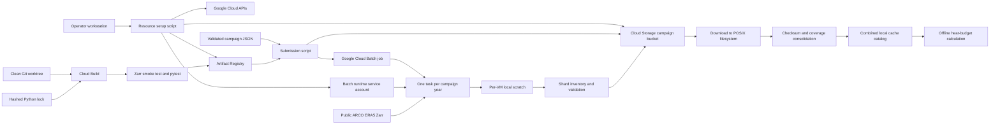

# Google Cloud Batch deployment

## Purpose and deployment boundary

This document describes the Google Cloud deployment implemented by the files in
`deployment/gcp/`, `Dockerfile`, `requirements-arco.in`, and
`requirements-arco.txt`. It is a code-faithful reference for resource
provisioning, image construction, Batch submission, yearly ARCO ERA5 staging,
Cloud Storage publication, local retrieval, and cache consolidation.

The current deployment boundary is important:

- Google Cloud Batch runs `deployment.gcp.run_yearly_retrieval`.
- Each Batch task retrieves and publishes one year of staged ARCO ERA5 input.
- Batch does not invoke `scripts/run_budget.py`.
- Heat-budget NetCDF calculation remains an offline or PBS production step that
  consumes the downloaded, consolidated staged cache.

For copyable production commands, start with the
[Google Cloud Batch production runbook](README.md).

## End-to-end architecture



The bucket is a publication target, not the working cache filesystem. Retrieval
and Zarr writes happen on the worker boot disk under `/scratch`. Only a complete
local shard is copied through the Cloud Storage FUSE mount, and the success
marker is published last.

## Source-file map

| File | Responsibility |
| --- | --- |
| `deployment/gcp/setup_batch_resources.sh` | Enables required APIs, creates or reconciles the bucket, Docker repository, runtime service account, and IAM bindings. |
| `deployment/gcp/build_arco_image.sh` | Submits a clean source tree to Cloud Build, tags it by Git commit by default, resolves the pushed image digest, and prints `IMAGE_URI`. |
| `deployment/gcp/campaign.example.json` | Tracked template for a complete staging campaign. |
| `deployment/gcp/campaign.py` | Strict campaign schema, normalization, validation, task-to-year mapping, and canonical SHA-256 identity. |
| `deployment/gcp/render_batch_job.py` | Renders the Batch API JSON with fixed worker, retry, logging, storage-mount, and environment settings. |
| `deployment/gcp/submit_arco_batch.sh` | Normalizes and uploads the campaign, records the rendered job JSON, and submits the Batch job. |
| `deployment/gcp/run_yearly_retrieval.py` | Container entrypoint that maps a Batch task to one year, stages locally, validates, publishes, resumes, and skips valid completed years. |
| `deployment/gcp/shard_artifacts.py` | Defines shard manifests, success markers, path safety, SQLite integrity checks, file inventories, and content signatures. |
| `scripts/staged_arco_retrieval.py` | Reads the public ARCO Zarr source, selects and materializes the requested data, chunks by time, and writes local indexed cache tiles. |
| `scripts/consolidate_staged_arco_cache.py` | Performs full local integrity and hourly-coverage validation, then creates the combined SQLite catalog. |
| `Dockerfile` | Builds the Python environment, gates the runtime image on smoke tests and pytest, and configures the non-root retrieval entrypoint. |
| `requirements-arco.in` | Human-maintained direct Python dependency set. |
| `requirements-arco.txt` | Auto-generated, fully resolved, version-pinned, hash-verified Python dependency lock. |

## Resource provisioning

### Default resource names

All three shell entrypoints accept overrides, but their defaults are aligned:

| Setting | Default |
| --- | --- |
| Project | `eulerian-heat-budget` |
| Region | `us-central1` |
| Bucket | `eulerian-heat-budget-arco-staged-us-central1` |
| Artifact Registry repository | `ehb-batch` |
| Image | `arco-retrieval` |
| Runtime service-account name | `ehb-batch-retrieval` |

Use the same overrides with setup, build, and submission. The scripts do not
share a generated state file, so inconsistent command-line overrides can point
the three phases at different resources.

### APIs

`setup_batch_resources.sh` enables:

- Batch API: `batch.googleapis.com`
- Compute Engine API: `compute.googleapis.com`
- Artifact Registry API: `artifactregistry.googleapis.com`
- Cloud Build API: `cloudbuild.googleapis.com`
- Cloud Logging API: `logging.googleapis.com`
- Cloud Storage API: `storage.googleapis.com`

### Cloud Storage bucket

The setup script creates or updates the bucket with:

- regional placement in the configured Batch region;
- `STANDARD` storage class;
- uniform bucket-level access;
- public access prevention; and
- a seven-day soft-delete duration.

If the bucket already exists in another region, setup fails. It does not move or
replace the bucket. Rerunning setup reapplies the mutable bucket settings.

Soft delete improves recovery from accidental object deletion, but retained
soft-deleted objects continue to consume storage during their retention window.
This matters when a failed publication is removed and republished.

### Artifact Registry

The repository is regional and must have format `DOCKER`. If a repository with
the requested name exists under a different format, setup fails. The runtime
service account receives repository-level `roles/artifactregistry.reader` so a
Batch VM can pull the digest-pinned image.

Cloud Build permissions are an operator prerequisite. The setup script does not
attempt to redesign the project's Cloud Build service-account policy.

### Runtime identity and IAM

The runtime service account is:

```text
SERVICE_ACCOUNT_NAME@PROJECT_ID.iam.gserviceaccount.com
```

The setup script applies these bindings:

| Principal | Scope | Role | Reason |
| --- | --- | --- | --- |
| Runtime service account | Project | `roles/batch.agentReporter` | Report task and agent state to Batch. |
| Runtime service account | Project | `roles/logging.logWriter` | Write task output to Cloud Logging. |
| Runtime service account | Artifact Registry repository | `roles/artifactregistry.reader` | Pull the runtime image. |
| Runtime service account | Campaign bucket | `roles/storage.objectUser` | Read, create, overwrite, and remove campaign objects used by publication and resume logic. |
| Submitter | Project | `roles/batch.jobsEditor` | Create and inspect Batch jobs. |
| Submitter | Runtime service account | `roles/iam.serviceAccountUser` | Attach the runtime identity to the Batch job. |
| Submitter | Campaign bucket | `roles/storage.objectUser` | Upload campaign and job JSON, and download campaign objects. |

When `--submitter` is absent, setup resolves the first active `gcloud` account
and constructs `user:ACCOUNT`. Pass an explicit IAM principal for service
accounts, groups, or a different user.

Logging Viewer and Artifact Registry Reader are not granted to the submitter.
They are needed separately when the operator reads logs or resolves the pushed
image digest. Local consolidation runs in an existing Python environment and
does not require the submitter to pull the runtime image.

### Idempotence and failure policy

Setup is designed to be rerunnable:

- APIs may already be enabled.
- Existing bucket and repository types are checked before update.
- The service account is created only when absent.
- IAM policy bindings are added declaratively.

It deliberately fails on incompatible immutable properties instead of creating
parallel resources or silently accepting the mismatch.

## Campaign contract

### Strict schema

`campaign.py` rejects missing fields, unknown fields, invalid types, and
incompatible options. The normalized document includes `schema_version: 1`,
sorts keys for stable storage, and has a canonical compact JSON representation
for hashing.

The top-level object contains:

| Field | Required content and constraints |
| --- | --- |
| `schema_version` | Optional in input. If present, it must be integer `1`. Normalization always writes it. |
| `campaign_id` | Lowercase letter first, then lowercase letters, digits, or hyphens, with at most 63 characters and no trailing hyphen. |
| `years` | Required `start` and `end` integers in `1..9999`, with start no later than end. |
| `season` | Required `start_month_day` and `end_month_day` in `MM-DD` format. Dates must exist for every campaign year and cannot cross a calendar-year boundary. |
| `domain` | Horizontal selection, margin, vertical boundaries, and bottom-overflow behavior. |
| `staging` | Time chunk, per-attempt timeout, and benchmark-variable choice. |

### Domain fields

Exactly one horizontal selector is required:

- `region`: a name present in `src/config.py::REGIONS`; or
- `bbox`: an object with `lat_min`, `lat_max`, `lon_min`, and `lon_max`.

Latitude bounds must satisfy `-90 <= lat_min < lat_max <= 90`. Longitude bounds
must satisfy `-180 <= lon_min < lon_max <= 360`.

Other required fields are:

| Field | Meaning and validation |
| --- | --- |
| `margin_n` | Number of horizontal grid points removed from each edge of the selected domain. Schema validation accepts nonnegative values, but the staged wall-stencil implementation requires at least `1`; use `1` or greater for production. |
| `zg_top_pa` | Positive top pressure boundary in Pa. |
| `zg_bottom` | Either `surface_pressure` or `pressure_level`. |
| `zg_bottom_pa` | Omitted for `surface_pressure`; required and greater than `zg_top_pa` for `pressure_level`. |
| `allow_bottom_overflow` | Boolean controlling whether the surface-pressure bottom layer may receive a weight greater than one when pressure extends below the available model grid. |

Region names are loaded directly from `src/config.py`, so campaign validation and
the scientific CLI use the same named bounds.

### Staging fields

| Field | Allowed values and effect |
| --- | --- |
| `time_chunk` | `month`, `day`, or `none`. Each chunk becomes a separate local Zarr tile. Monthly chunks are the production default in the example. |
| `attempt_timeout_seconds` | Nonnegative number. `0` disables the per-attempt alarm. The example uses `10800`, or three hours. |
| `include_benchmark_variables` | Boolean. When true, four vertically integrated ARCO flux fields are included in addition to core budget inputs. |

Staging always passes `--no-use-surface-variables`. The staged-cache format does
not support `T2m`, `u10`, or `v10`.

### Identity and immutability

The campaign SHA-256 is computed from canonical normalized JSON. That identity
is embedded in the Batch task environment, every shard manifest, and every
success marker.

Submission writes the normalized campaign to:

```text
gs://BUCKET/campaigns/CAMPAIGN_ID/campaign.json
```

The first upload uses a zero-generation precondition. If the object already
exists or is created concurrently, the submission script downloads, normalizes,
and compares it. Reusing the same ID with different parameters fails before job
submission.

Use a different ID for a canary and for every scientifically distinct campaign.

## Container and dependency design

### Multi-stage image

The `Dockerfile` uses `python:3.12.11-slim-bookworm` and three stages.

#### Base stage

The base stage:

1. installs CA certificates and `tini`;
2. creates `/opt/venv`;
3. copies only `requirements-arco.txt` first for layer reuse; and
4. installs with `pip --require-hashes --no-cache-dir`.

Hash verification means every resolved archive or wheel must match one of the
lock-file hashes. Unlocked transitive resolution is not permitted during image
construction.

#### Test stage

The test stage installs Git, copies the build context, then runs:

1. a real temporary Xarray-to-Zarr write;
2. a Zarr reopen and close; and
3. the complete test suite with `python -m pytest -q`.

Only after all checks pass does it create `/tmp/ehb-tests-passed`. The runtime
stage copies that sentinel from the test stage, which makes the test stage a
required dependency of the final image rather than an optional target.

Git is needed by tests but is not installed in the runtime image. `.git`, local
results, caches, logs, virtual environments, NetCDF files, and Zarr stores are
excluded by `.dockerignore`.

#### Runtime stage

The runtime stage:

- creates user and group `ehb` with UID and GID `10001`;
- creates writable local scratch at `/scratch`;
- copies the tested repository as UID/GID `10001`;
- runs as the non-root `ehb` user; and
- uses `tini` to supervise `python -m deployment.gcp.run_yearly_retrieval`.

The non-root UID is also configured on the Cloud Storage FUSE mount. This keeps
the runtime process, local scratch, and mounted output permissions aligned.

### Build wrapper and image identity

`build_arco_image.sh` requires a clean Git worktree by default. Its default tag
is:

```text
git-GIT_SHORT_SHA
```

`--allow-dirty` exists for development, but it weakens source provenance and
should not be used for production. `--tag` can override the human-readable tag.

After Cloud Build pushes the tag, the script queries Artifact Registry and
prints the immutable digest reference:

```text
IMAGE_URI=REGION-docker.pkg.dev/PROJECT/REPOSITORY/IMAGE@sha256:DIGEST
```

Only this digest form is accepted by the job renderer. The uploaded job JSON
therefore records the exact runtime bytes independently of later tag changes.

### Direct dependencies

`requirements-arco.in` is the human-maintained input:

| Requirement | Role in this deployment | Current locked version |
| --- | --- | --- |
| `dask[array,distributed]` | Lazy arrays, chunk execution, and scheduler support used by Xarray and staging. | `2026.7.1` |
| `gcsfs` | FSSpec access to public and authenticated Google Cloud Storage data. | `2026.7.0` |
| `matplotlib` | Calculation diagnostics and modules imported by the shared codebase and tests. | `3.11.0` |
| `numpy` | Array operations, datetime coverage validation, and scientific calculations. | `2.5.1` |
| `pytest` | Image build gate and repository test suite. | `9.1.1` |
| `scipy` | Scientific routines used by the heat-budget code. | `1.18.0` |
| `xarray` | ARCO dataset selection, Zarr reads and writes, and labeled-array calculations. | `2026.7.0` |
| `zarr` | Staged tile storage format. | `3.2.1` |

`requirements-arco.txt` is generated by `pip-compile` under Python 3.12. It
currently resolves 75 direct and transitive distributions, pins every version,
records dependency provenance comments, and includes permitted artifact hashes.
It is auto-generated and must not be edited manually.

After intentionally changing `requirements-arco.in`, regenerate the lock with a
Python 3.12 `pip-tools` environment:

```bash
pip-compile \
  --generate-hashes \
  --output-file=requirements-arco.txt \
  requirements-arco.in
```

Then rebuild the image. The Zarr smoke test and full pytest suite are the
compatibility gate for the new resolution.

## Batch job rendering

### Validation before rendering

`render_batch_job.py` rejects:

- a non-digest image URI;
- an invalid or overlong job ID;
- an empty project, region, bucket, or service-account email;
- parallelism below one or above the campaign task count; and
- a boot disk smaller than 30 GB.

The default submit wrapper creates a 63-character-safe job ID from the first 47
characters of the campaign ID and a UTC timestamp.

### Task group and VM profile

The rendered job has one task group:

| Setting | Value |
| --- | --- |
| Task count | Number of inclusive campaign years |
| Task index mapping | `start_year + BATCH_TASK_INDEX` |
| Default parallelism | `5` |
| Tasks per VM | `1` |
| CPU per task | `2000` milli-CPU |
| Memory per task | `7000` MiB |
| Machine type | `e2-standard-2` |
| Provisioning model | `STANDARD` |
| Boot disk | `pd-balanced`, 40 GB default, 30 GB minimum |
| Task retries | Up to 2 retries after the initial attempt |
| Maximum task duration | `172800s`, or 48 hours |
| Logs | Cloud Logging |

At the default parallelism, Batch may run five VMs concurrently, consuming ten
vCPUs and 200 GB of balanced persistent disk while all five are active. Actual
scheduling also depends on regional capacity and project quotas.

The renderer does not set a VPC or subnetwork. Projects with a removed or
restricted default network must add an appropriate Batch networking policy in
code before submission. Workers need access to Google APIs and the public ARCO
ERA5 bucket.

### Task environment

The renderer provides:

| Variable | Value or purpose |
| --- | --- |
| `EHB_CAMPAIGN_JSON` | Canonical compact campaign JSON. |
| `EHB_CAMPAIGN_SHA256` | Expected canonical campaign hash. |
| `EHB_LOCAL_SCRATCH` | `/scratch` |
| `EHB_OUTPUT_MOUNT` | `/mnt/disks/arco-output` |
| `PYTHONUNBUFFERED` | Immediate task logs. |
| `DASK_SCHEDULER` | `threads` |
| `DASK_NUM_WORKERS` | `2` |
| `OMP_NUM_THREADS` | `1` |
| `MKL_NUM_THREADS` | `1` |
| `OPENBLAS_NUM_THREADS` | `1` |
| `NUMEXPR_NUM_THREADS` | `1` |

Batch adds `BATCH_TASK_INDEX`, `BATCH_TASK_COUNT`, and retry metadata. The
entrypoint verifies the task count against the number of campaign years before
doing any retrieval.

### Cloud Storage FUSE mount

The remote campaign prefix is mounted at `/mnt/disks/arco-output`. Mount options
enable implicit directories and map files and directories to runtime UID/GID
`10001`, with file mode `0660` and directory mode `0770`.

Only the campaign prefix is mounted, so the entrypoint publishes relative paths
such as `shards/year=1940` directly under that mount.

### Submission records

`submit_arco_batch.sh` renders temporary normalized campaign and job JSON files,
then persists the durable records before submission:

```text
campaigns/CAMPAIGN_ID/campaign.json
campaigns/CAMPAIGN_ID/batch-jobs/JOB_ID.json
```

The job JSON captures the image digest, resource profile, runtime identity,
campaign JSON and hash, labels, mount, and environment. This is the primary
cloud-side execution record after Batch eventually ages out its own job resource.

## Yearly retrieval lifecycle

### Task-to-year mapping

For a campaign from `START_YEAR` through `END_YEAR`, the renderer creates
`END_YEAR - START_YEAR + 1` tasks. Task zero handles `START_YEAR`; the final task
handles `END_YEAR`.

Each season expands to inclusive hourly bounds:

```text
YEAR-START_MONTH_DAYT00:00:00
YEAR-END_MONTH_DAYT23:00:00
```

### Local working directory

A task writes to:

```text
/scratch/CAMPAIGN_ID/year=YYYY/
```

The directory is removed at the beginning of a fresh task attempt. This avoids
mixing local output from a previous attempt with the current shard.

### Retrieval command

The entrypoint constructs an explicit invocation of
`scripts/staged_arco_retrieval.py` with:

- data source fixed to `arco_era5`;
- the exact yearly start and end timestamps;
- campaign time chunk and attempt timeout;
- named region or explicit bounds;
- margin and vertical boundary values;
- explicit bottom-overflow behavior;
- surface variables disabled; and
- benchmark variables enabled only when requested by the campaign.

It does not import scientific settings from the PBS scheduler files.

### ARCO access and selection

The public source is configured in `src/config.py` as:

```text
gs://gcp-public-data-arco-era5/ar/full_37-1h-0p25deg-chunk-1.zarr-v3
```

The source token is anonymous. No source credential is embedded in the campaign
or image.

The source is opened with `chunks=None` before variable, time, region, and
vertical selection. This is intentional: the multi-petabyte store has large
native chunks, and constructing a Dask graph for the unselected global store can
exhaust a small worker before useful selection occurs.

Core source variables are renamed to the internal schema:

| ARCO variable | Staged name |
| --- | --- |
| `temperature` | `T` |
| `u_component_of_wind` | `u`, stored compactly as `u_wall` |
| `v_component_of_wind` | `v`, stored compactly as `v_wall` |
| `vertical_velocity` | `w` |
| `surface_pressure` | `sp` |

Optional benchmark variables are:

| ARCO variable | Staged name |
| --- | --- |
| `vertical_integral_of_eastward_heat_flux` | `Fx_heat` |
| `vertical_integral_of_northward_heat_flux` | `Fy_heat` |
| `vertical_integral_of_eastward_mass_flux` | `Fx_mass` |
| `vertical_integral_of_northward_mass_flux` | `Fy_mass` |

The cache stores full selected `T`, `w`, and `sp` fields but only the lateral
wall stencils required from `u` and `v`. Benchmark fluxes also use compact wall
storage. This reduces shard size while allowing the cache loader to reconstruct
the canonical arrays required by the budget calculation.

### Chunking and retries

Monthly staging splits a season at calendar-month boundaries. Daily staging
splits at midnight. `none` uses one tile for the full yearly season. Chunk bounds
remain inclusive and hourly, and adjacent tiles do not overlap.

An exact tile already registered in the local yearly SQLite catalog is skipped.
For each new tile, the retrieval code allows up to four attempts for recognized
transient ARCO errors, with exponential delays starting at 15 seconds. The
campaign timeout limits each materialize-and-write attempt. Batch separately
allows two task retries, so library-level retries and infrastructure-level
retries protect different failure classes.

### Tile write protocol

Each time chunk is materialized, normalized to cache chunk sizes, and written to
a temporary Zarr directory. Under a local write lock, the temporary store is
promoted to its content-derived final tile path and registered in `cache.sqlite`.
Failed temporary stores and unfinished lock artifacts are rejected by shard
publication.

## Publication and integrity model

### Campaign object layout

```text
campaigns/CAMPAIGN_ID/
  campaign.json
  batch-jobs/
    JOB_ID.json
  shards/
    year=YYYY/
      cache.sqlite
      tiles/
        TILE_ID.zarr/
          ...
      shard-manifest.json
      _SUCCESS.json
```

After optional metadata upload following consolidation, the campaign root may
also contain:

```text
cache.sqlite
consolidation.json
```

The root `cache.sqlite` is the combined catalog. Each yearly `cache.sqlite` is a
shard-local catalog and remains part of that shard's integrity manifest.

### Shard manifest

Before publication, the entrypoint validates the local SQLite database and its
tile paths. It rejects:

- a missing or corrupt database;
- an unexpected `tiles` schema;
- an empty catalog;
- missing Zarr group metadata;
- unsafe relative paths;
- symbolic links;
- an unfinished `.write.lock`; and
- temporary Zarr directories left by interrupted writes.

`shard-manifest.json` records:

- schema version;
- campaign hash;
- year and exact expected time bounds;
- creation timestamp;
- tile IDs; and
- every published file's relative path, byte size, and SHA-256.

### Success marker and completion semantics

Publication follows this order:

1. If a success marker exists, validate its campaign identity and basic shard
   structure, then exit successfully.
2. If the yearly prefix exists without a success marker, remove the incomplete
   prefix.
3. Copy every manifest-listed data file.
4. Copy the shard manifest.
5. Verify the published file inventory and sizes.
6. Verify that the published manifest bytes match the local manifest.
7. Write and copy `_SUCCESS.json` last.

The success marker records campaign hash, year, manifest hash, publication time,
task index, and Batch retry attempt. Consumers must treat its absence as an
incomplete shard, even when data objects are present.

Cloud-side publication avoids rereading every object for SHA-256 after copying,
which would be expensive through FUSE. Full SHA-256 verification happens during
local consolidation after download.

### Resume behavior

Submitting the same campaign again creates tasks for every year, but completed
years exit quickly after validating their markers. Incomplete years have their
prefixes removed and are rebuilt. This makes a new Batch job the supported
campaign-level resume mechanism.

A completed shard associated with a different campaign hash is an error, not a
cache hit. A changed campaign must use a new ID and prefix.

## Download and consolidation

### Why consolidation is local

The combined catalog contains relative filesystem paths into the yearly Zarr
stores. It is intended for a downloaded directory on a POSIX filesystem. Cloud
Storage and its FUSE mount are not used as the live database or calculation
cache.

`gcloud storage rsync` transfers data through the machine running the command.
For the full historical campaign, choose a consolidation host with reliable
networking and sufficient local disk. A fresh destination directory prevents
old local years from being mistaken for campaign content.

### Existing Python environment

Run `scripts/consolidate_staged_arco_cache.py` directly from the repository root
with an existing Python environment containing the dependencies locked in
`requirements-arco.txt`. Docker and Artifact Registry access are not required
for local consolidation.

Use the consolidator source corresponding to the retrieval image, or a reviewed
compatible commit. Record the repository commit, resolved Python executable,
and environment dependency state with the campaign provenance. The cache root
must be writable because the consolidator atomically replaces `cache.sqlite`
and `consolidation.json`.

### Validation algorithm

`consolidate_staged_arco_cache.py` performs these checks before replacing the
root catalog:

1. Load and validate root `campaign.json`.
2. Require exactly the expected inclusive set of `year=YYYY` directories.
3. Require and validate each `_SUCCESS.json` and its manifest hash.
4. Require an exact manifest inventory, byte size, and SHA-256 for every file.
5. Run SQLite integrity checks and require the exact `tiles` table schema.
6. Require identical SQLite schema SQL across years.
7. Check every tile request against the campaign domain and benchmark setting.
8. Require the configured public ARCO source and matching catalog/source times.
9. Open each Zarr store and validate its time coordinate against its catalog row.
10. Reject duplicate or overlapping timestamps within a year.
11. Require every hourly timestamp from season start through season end.
12. Reject unsafe path traversal and missing tile content.
13. Deduplicate a repeated tile ID only when both catalog metadata and content
    signature are identical; reject conflicts.

Only after all years pass does the script create a temporary SQLite database,
insert combined rows with paths such as
`shards/year=YYYY/tiles/TILE_ID.zarr`, run another SQLite integrity check, and
atomically replace root `cache.sqlite`.

It then atomically writes `consolidation.json` with:

- schema version;
- campaign ID and hash;
- full time range;
- year and tile counts; and
- a summary and manifest identity for every yearly shard.

If validation fails, an existing combined `cache.sqlite` is preserved. Rerunning
consolidation is safe and produces the same logical catalog when the downloaded
campaign has not changed.

### Calculation handoff

After consolidation, use the campaign root as:

```text
--data-source staged_arco_cache --staged-cache-root /path/to/CAMPAIGN_ID
```

The cache loader selects a full-cover tile or a time mosaic, verifies exact
hourly coverage again, checks wall stencils, and reconstructs the canonical
`T`, `u`, `v`, `w`, and `sp` dataset. If benchmark variables were staged, it can
also reconstruct the four benchmark flux arrays.

For the intended campaign calculation, keep the same domain, margin, vertical
boundaries, overflow behavior, time windows, and benchmark-variable setting.
The loader can technically serve some requests that are strict subsets of the
staged coverage, but those are distinct scientific runs and should have their
own provenance. Surface variables cannot be requested.

## Observability and operations

### Job and task state

Use `gcloud batch jobs describe` for job status and status events, and
`gcloud batch tasks list` for per-task state. Batch job resources are not the
long-term provenance store, so retain the job JSON already written under the
campaign prefix.

The current official command forms are documented in Google Cloud's
[view jobs and tasks guide](https://cloud.google.com/batch/docs/view-jobs-tasks).

### Logs

The rendered job sends task stdout and stderr to `batch_task_logs`. Resolve the
job UID and filter Cloud Logging on both the project log name and
`labels.job_uid`. Retrieval messages include UTC timestamps, year, time chunk,
attempt number, source selection, tile sizes, publication progress, and skip
behavior.

The runtime identity has permission to write logs. The person reading them needs
Logging Viewer or an equivalent permission. Google Cloud's
[Batch log analysis guide](https://cloud.google.com/batch/docs/analyze-job-using-logs)
describes the same job-UID filter.

### Labels

Jobs are labeled:

```text
application=eulerian-heat-budget
campaign=CAMPAIGN_ID
workload=arco-retrieval
```

These labels support inventory and billing analysis. The campaign ID must also
satisfy Google Cloud label-value rules, which are already compatible with the
campaign schema.

### Quotas and disk sizing

The observed yearly cache size cited by the original deployment notes was about
4.5 GB for its campaign, but actual use varies with domain, season, vertical
range, chunking, and benchmark fields. Keep enough boot-disk headroom for:

- local Zarr temporary writes;
- the promoted tile set;
- SQLite and integrity metadata;
- Python and container filesystem use; and
- retry cleanup behavior.

Measure canary scratch and object sizes before reducing the 40 GB default.
Parallelism multiplies VM, vCPU, and persistent-disk demand.

## Failure modes and recovery

| Symptom | Likely cause | Recovery |
| --- | --- | --- |
| Setup rejects the bucket location | Existing bucket is not in the configured region. | Choose the correct existing region consistently or create a new bucket name in the intended region. |
| Setup rejects repository format | Existing repository is not Docker format. | Use a different repository name or deliberately replace the incompatible resource outside this script. |
| Build refuses to start | Git worktree is dirty. | Commit intended production changes and remove only known generated noise. Use `--allow-dirty` only for development. |
| Build fails before push | Dependency install, Zarr smoke test, or pytest failed. | Fix the lock, code, or tests. Do not bypass the image gate. |
| Submission rejects image | URI uses a tag rather than a digest. | Capture the `IMAGE_URI` printed by the build wrapper. |
| Submission reports different campaign configuration | Existing campaign ID is already bound to another normalized JSON document. | Restore the original file for resume or choose a new campaign ID. |
| Job remains queued | Regional compute or disk quota, capacity, or policy constraint. | Inspect Batch status events, then adjust quota, region, policy, or parallelism. |
| Worker cannot pull image | Runtime service-account binding drift or repository mismatch. | Rerun setup with consistent values and inspect repository IAM. |
| Worker cannot reach ARCO | Network policy blocks Google API or public bucket access. | Provide an allowed Batch network path and retry with a new job ID. |
| No task logs | Logging API, log policy, runtime writer role, or viewer role is missing. | Rerun setup for writer/API state and grant the operator log-view permission. |
| Task times out during a tile | Campaign per-attempt timeout is too short or the source is slow. | Inspect logs, then use a new campaign ID if changing timeout or chunking. |
| New job skips a year | A valid success marker already exists for that campaign hash and year. | This is expected resume behavior. |
| New job deletes a yearly prefix | The prefix lacked a success marker and was considered incomplete. | This is expected recovery behavior; soft delete retains deleted objects temporarily. |
| Consolidator reports missing year | Batch is incomplete or download did not finish. | Confirm job/tasks and markers, rerun `gcloud storage rsync`, then rerun consolidation. |
| Consolidator reports checksum mismatch | Download corruption, cloud object mutation, or incomplete transfer. | Redownload the affected campaign into a clean directory and investigate object provenance. |
| Consolidator reports incomplete hourly coverage | A shard's tiles have a time gap despite publication metadata. | Treat the shard as invalid, remove or isolate its cloud prefix with operator approval, and resubmit the same campaign. |
| Consolidator cannot import a dependency | The selected Python environment is incomplete or not active. | Use the existing environment containing the packages locked in `requirements-arco.txt`, then rerun the import check and consolidation. |
| Consolidator cannot write output | The downloaded campaign root is not writable. | Correct ownership or permissions on the explicit cache root, then rerun consolidation. |
| Offline budget loader rejects cache | Calculation request differs from staged coverage or asks for unsupported surface fields. | Align calculation parameters with `campaign.json` and keep surface variables disabled. |

## Change-management checklist

When changing the deployment:

1. Update human-maintained source only. Never hand-edit the generated dependency
   lock.
2. Add or update unit tests for campaign, renderer, resume, manifest, or
   consolidation behavior.
3. Run the complete local test suite in a compatible environment.
4. Commit the source on a named branch.
5. Build without `--allow-dirty`; Cloud Build repeats the Zarr and pytest gates.
6. Capture the image digest.
7. Create a new campaign ID if any normalized campaign parameter changed.
8. Run, download, consolidate, and open a one-year canary.
9. Submit the full production campaign at measured parallelism.
10. Preserve normalized campaign JSON, rendered job JSON, image digest, shard
    manifests, success markers, and consolidation summary as provenance.

## Related documentation

- [Production command runbook](README.md)
- [Current code outline](code_outline.md)
- [Eulerian Heat Budget - Reformulation](<Eulerian Heat Budget - Reformulation.md>)
- [Google Cloud Batch documentation](https://cloud.google.com/batch/docs)
- [`gcloud storage rsync` reference](https://cloud.google.com/sdk/gcloud/reference/storage/rsync)
